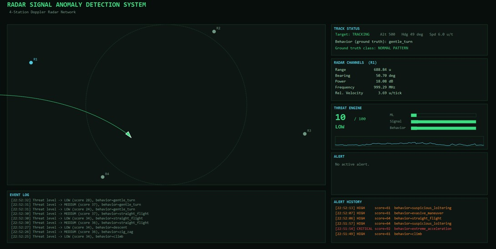
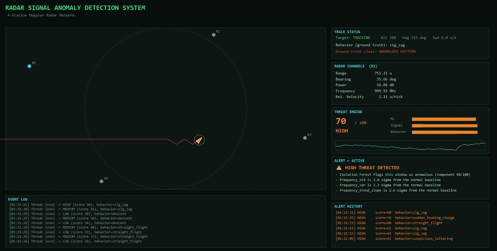

# Anomaly Detection  for Electronic Warfare System
Radar systems generate large volumes of signal data that must be continuously monitored to identify unusual or suspicious behavior. This project presents a Radar Anomaly Detection System that simulates a multi-radar surveillance environment and applies machine learning to detect abnormal radar signal patterns in real time.

The system tracks aircraft using multiple radar stations and generates live radar measurements including Direction of Arrival (DOA), Amplitude, Frequency, and Power. Realistic Gaussian measurement noise is incorporated to emulate real-world radar sensor uncertainty. These measurements are continuously analyzed to identify deviations from normal radar behavior.

An Isolation Forest based anomaly detection model is used to learn normal radar signal patterns and detect unusual events such as DOA drift, frequency spikes, amplitude spikes, power surges, and frozen signal conditions. The detected anomalies are displayed through a real-time dashboard along with threat level indicators and anomaly scores.

This project demonstrates the application of machine learning, signal analysis, and real-time monitoring concepts in radar surveillance and electronic warfare inspired environments.

```text

```

## Quick Start

```bash
pip install -r requirements.txt

# 1. Generate normal-only training data, then train the model
python generate_training_data.py
python train_model.py

# 2. Generate labeled test data and check real accuracy/precision/recall
python generate_test_data.py
python evaluate_model.py

# 3. Run an offline prediction against a raw track CSV
python predict.py
python predict.py path/to/your_track.csv

# 4. Launch the live dashboard
python main.py
```


---

## Dashboard Preview

### Normal Operation



The system continuously tracks aircraft within radar coverage and monitors range, bearing, power, frequency, and relative velocity in real time.

### Anomaly Detection



When anomalous flight behavior is detected, the threat engine combines Isolation Forest output with signal and behavioral abnormality metrics to produce a threat score, alert classification, and operator notification.

---

## Architecture

| Stage                 | File                                          | Responsibility                                                                                                                                |
| --------------------- | --------------------------------------------- | --------------------------------------------------------------------------------------------------------------------------------------------- |
| 1. Aircraft Simulator | `behaviors.py`, `aircraft_simulator.py`       | Defines every flight behavior (normal and anomalous) and integrates aircraft position/heading/altitude one tick at a time.                    |
| 2. Radar Simulator    | `radar_simulator.py`                          | Converts aircraft position into 5 noisy radar channels (range, bearing, power, frequency, relative velocity) from a 4-station ground network. |
| 3. Data Logger        | `data_logger.py`                              | Buffers raw measurements into a rolling window; optionally persists to CSV.                                                                   |
| 4. Feature Extraction | `feature_extraction.py`                       | The canonical function that turns a window of raw measurements into a statistical feature vector.                                             |
| 5. Isolation Forest   | `isolation_forest_model.py`, `train_model.py` | Trains, loads, and scores the anomaly detection model.                                                                                        |
| 6. Threat Engine      | `threat_engine.py`                            | Combines model output with signal and behavioral abnormality checks into an explainable 0–100 threat score.                                   |
| 7. Dashboard          | `dashboard.py`, `main.py`, `voice_alert.py`   | PyQt6 live visualization with aircraft tracking, threat assessment, alert history, event logs, and voice-based alerts.                        |

### Supporting Pipeline Scripts

| File                        | Purpose                                                                     | Input                 | Output                                           |
| --------------------------- | --------------------------------------------------------------------------- | --------------------- | ------------------------------------------------ |
| `config.py`                 | Single source of truth for constants and thresholds.                        | —                     | —                                                |
| `simulate_track.py`         | Shared track-simulation function used by both training and test generators. | Behavior schedule     | Raw measurement rows + anomaly flags             |
| `generate_training_data.py` | Simulates normal-only passes.                                               | `NORMAL_BEHAVIORS`    | `data/training_features.csv`                     |
| `generate_test_data.py`     | Simulates labeled test passes with anomaly injection.                       | `ANOMALOUS_BEHAVIORS` | `data/test_features.csv`, `data/test_tracks.csv` |
| `train_model.py`            | Trains Isolation Forest and computes baseline statistics.                   | Training features     | Model + baseline                                 |
| `evaluate_model.py`         | Computes Accuracy, Precision, Recall, F1, and Confusion Matrix.             | Test features         | Printed metrics                                  |
| `predict.py`                | Offline prediction pipeline.                                                | Raw track CSV         | `data/prediction_results.csv`                    |

---

## Behaviors

### Normal Behaviors

* `straight_flight`
* `gentle_turn`
* `climb`
* `descent`

### Anomalous Behaviors

* `sudden_heading_change`
* `zig_zag`
* `extreme_acceleration`
* `suspicious_loitering`
* `altitude_spike`
* `evasive_maneuver`

Training data is generated exclusively from normal behaviors. Anomalous behaviors are only injected during testing and demonstration runs.

---

## Threat Scoring

`threat_engine.py` blends three components into the final 0–100 threat score:

* **ML Component (50%)** – Isolation Forest anomaly score calibrated against the training distribution.
* **Signal Component (25%)** – Deviation of `power` and `frequency` statistics from baseline.
* **Behavior Component (25%)** – Deviation of `range`, `bearing`, and `relative_velocity` statistics from baseline.

Threat levels:

* **LOW:** < 35
* **MEDIUM:** 35–60
* **HIGH:** 60–82
* **CRITICAL:** ≥ 82

Every assessment also includes a list of contributing factors so detections remain explainable.

---

## Voice Alerts

The dashboard includes a voice alert subsystem implemented in `voice_alert.py`.

When the threat level reaches HIGH or CRITICAL, the system generates audio warnings for the operator. Voice alerts are rate-limited to prevent excessive repetition during sustained detections.

Example alerts:

* "Warning. High threat detected."
* "Warning. Critical threat detected."

---

## Known Limitations / Tuning Knobs

This is a simulation-based anomaly detection system and not a production radar processing platform.

On the bundled evaluation dataset it currently achieves approximately:

* Accuracy: ~90%
* Precision: ~67%
* Recall: ~71%

Useful tuning parameters in `config.py`:

* `ISOLATION_FOREST_CONTAMINATION`
* `THREAT_LEVEL_THRESHOLDS`
* `WINDOW_SIZE`
* `WINDOW_STEP`

---

## Project Structure

```text
radar_v2/
├── config.py
├── behaviors.py
├── aircraft_simulator.py
├── radar_simulator.py
├── data_logger.py
├── feature_extraction.py
├── isolation_forest_model.py
├── threat_engine.py
├── simulate_track.py
├── generate_training_data.py
├── generate_test_data.py
├── train_model.py
├── evaluate_model.py
├── predict.py
├── dashboard.py
├── voice_alert.py
├── main.py
├── data/
├── models/
├── screenshots/
│   ├── normal_detection.png.jpeg
│   └── anomaly_detection.png.jpeg
├── requirements.txt
└── .gitignore
```
